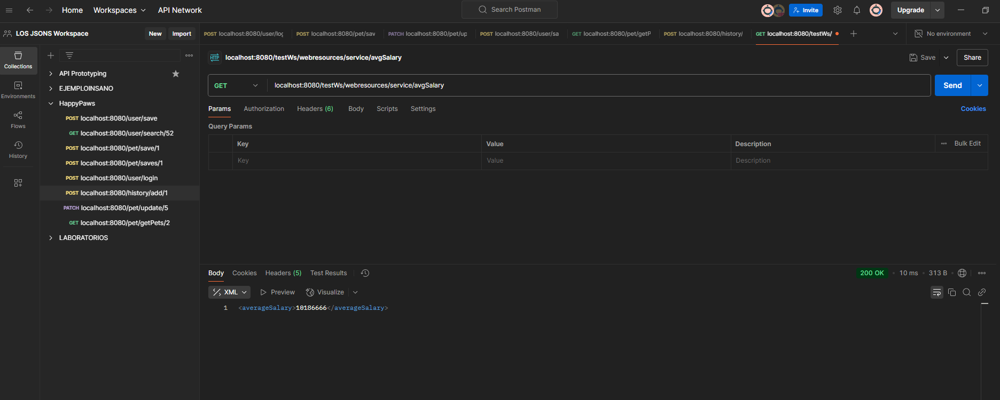
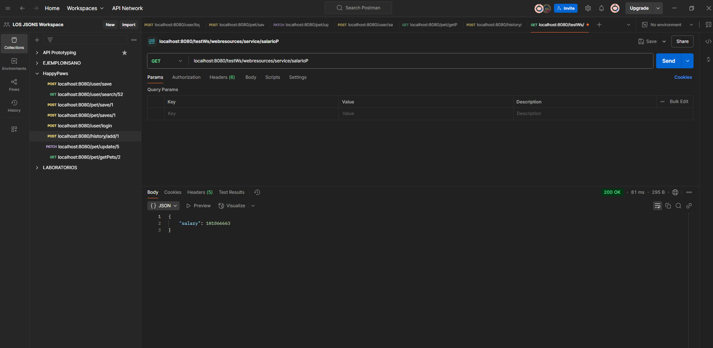

**Resultados**
- Adicionar un nuevo servicio REST que permita conocer el salario promedio en formato XML
  - 
- Adicionar un servicio REST para mostrar la suma de los salarios de las personas en formato JSON.
- 
